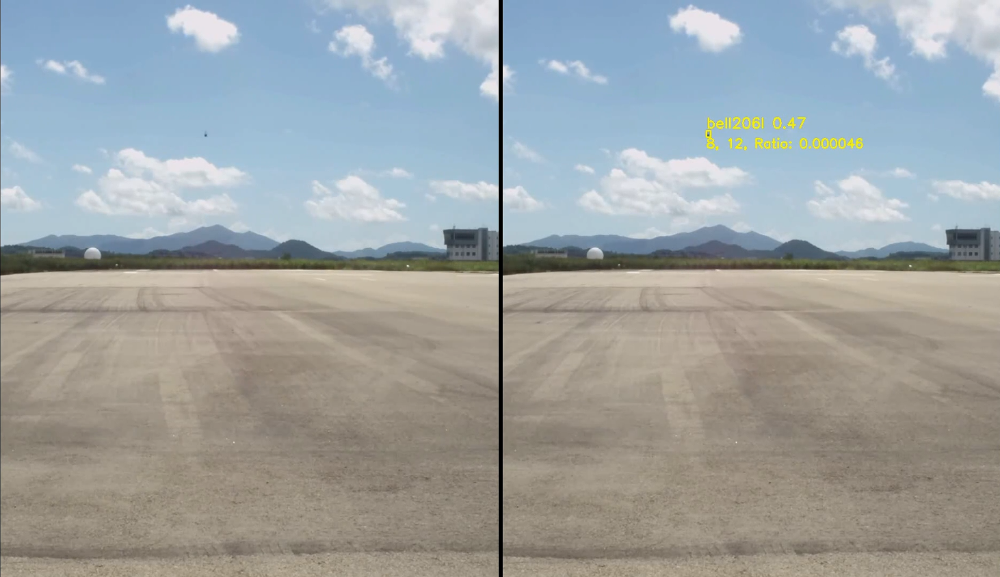
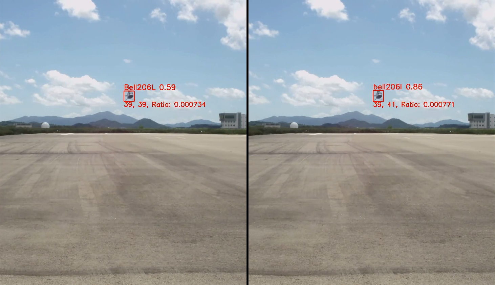

### YOLO + P2 
- 장점: 작은 객체 Recall 상승 (특히 원거리 “점 객체”)
- 단점: FPS 하락 + FP 증가 가능(고해상도 feature라 노이즈도 잘 잡음) </br>
※ 공항 감시에서는 보통 FP는 Tracker/후처리로 거르고, Recall을 확보하는 쪽이 유리

### P2 추가의 핵심 개념
1. Backbone에서 stride=4 feature를 끌어올린다
2. Neck(FPN/PAN)에 P2 경로를 추가한다
3. Detect head에서 P2를 출력에 포함시킨다

---

원본 yaml 파일 (D:\SW-test\yolo+p2\.venv\Lib\site-packages\ultralytics\cfg\models\11\yolo11.yaml)을
복사하여 yolo11_p2.yaml로 저장 후 수정

- P2 헤드를 추가하면 레이어 개수가 달라져서 기존 pt를 “완벽 동일 구조”로는 못 씀.
- 대신 Ultralytics는 매칭되는 레이어만 부분 로드(transfer)하는 방식으로 파인튜닝이 가능.
- => 파인튜닝하여 성능을 확인해야 함.

이미지 사이즈
- imgsz=640  → actual input: 384x640
- imgsz=1088 → actual input: 640x1088

### 가상환경 세팅
- python 3.11
```
pip install torch torchvision torchaudio --index-url https://download.pytorch.org/whl/cu124
pip install ultralytics
```
---
### 학습 설정
yolo+p2 학습 :
1. yolo11l+p2 + dataset.yaml(coco9) + 640 -> 80(Backbone Freeze) + 20(Unfreeze) epoch
2. yolo11l+p2 + cessna_fhd.yaml + 640/960/1088 -> 40(Backbone Freeze) + 20(Unfreeze) epoch

non-p2 학습 :
1. yolo11l + cessna_fhd.yaml + 640/960/1088 -> 40(Backbone Freeze) + 20(Unfreeze) epoch

---
### 학습 모델
- yolo11x (x 모델은 너무 오래 걸려서 중단) 
- yolo11l 
- yolo11l+p2 
- (추가실험) yolo11l+p2+p1

---
### 데모 영상
- 입력 영상 : Bell206L FHD (1920x1080, 30fps)
- 모델 입력 해상도 : 960
- 모델 학습 : coco9 + bell206l (Backbone Freeze 40 epoch + Unfreeze 20 epoch)
- 비교 모델 : yolo11l vs. yolo11l+p2
- 비교 항목 : bbox 시각화 + small object 카운트 + 누적 detection
- 결과 : yolo11l+p2가 원거리 작은 객체를 더 잘 탐지

원거리 접근 시:

근거리 접근 시:

